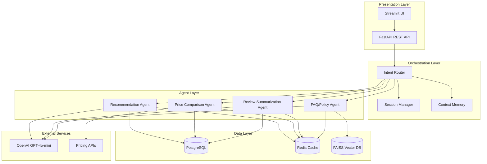
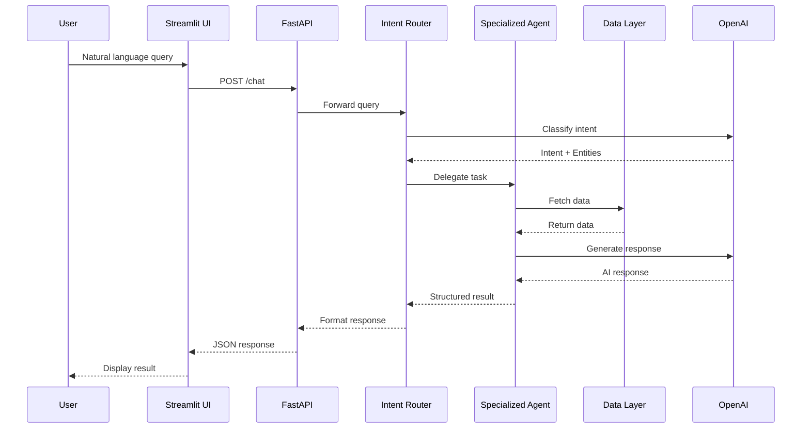
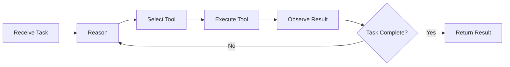
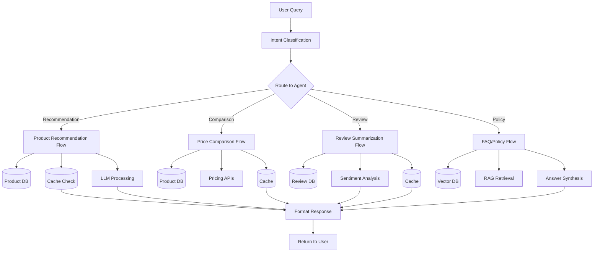
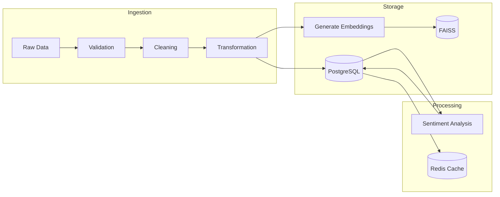
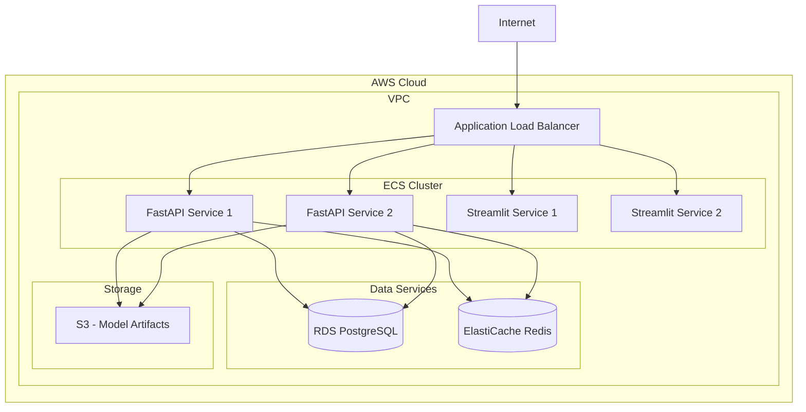

# SmartShop AI - System Architecture

## Table of Contents
1. [Overview](#overview)
2. [System Architecture](#system-architecture)
3. [Multi-Agent Architecture](#multi-agent-architecture)
4. [Data Flow](#data-flow)
5. [Component Details](#component-details)
6. [Technology Stack](#technology-stack)
7. [Deployment Architecture](#deployment-architecture)

---

## Overview

SmartShop AI is built on a **microservices-oriented, multi-agent architecture** that separates concerns across presentation, orchestration, agent, and data layers. This modular design enables independent scaling, testing, and enhancement of each capability.

### Core Design Principles

1. **Separation of Concerns** - Each layer has a specific responsibility
2. **Modularity** - Agents operate independently and can be deployed separately
3. **Scalability** - Horizontal scaling at the API and agent layers
4. **Resilience** - Circuit breakers, fallbacks, and graceful degradation
5. **Observability** - Comprehensive logging, monitoring, and tracing

---

## System Architecture



---

## Multi-Agent Architecture

### Agent Communication Flow



### Agent Reasoning Loop (ReAct Pattern)

Each agent follows the **ReAct (Reason + Act)** paradigm:



**Steps:**
1. **Reason** - Analyze task and determine next action
2. **Select Tool** - Choose appropriate tool (DB query, API call, LLM)
3. **Execute** - Run the selected tool
4. **Observe** - Analyze the results
5. **Repeat** - Continue until task is complete

---

## Data Flow

### Request Lifecycle



### Data Pipeline



---

## Component Details

### 1. Presentation Layer

#### Streamlit UI
- **Purpose**: Interactive chat interface for end users
- **Features**:
  - Multi-module navigation (Chat, Comparison, Reviews, Pricing)
  - Real-time agent responses
  - Product visualization with images and ratings
  - Session persistence
- **Communication**: REST API calls to FastAPI backend

#### FastAPI Backend
- **Purpose**: RESTful API gateway
- **Endpoints**:
  - `POST /chat` - Main chat interface
  - `GET /products` - Product search
  - `POST /agents/{agent_name}` - Direct agent invocation
  - `GET /health` - Health check
- **Features**:
  - Auto-generated OpenAPI documentation
  - Request validation with Pydantic
  - Async request handling
  - Rate limiting

### 2. Orchestration Layer

#### Intent Router
- **Purpose**: Classify user intent and route to appropriate agent
- **Method**: LLM-based classification with GPT-4o-mini
- **Intent Categories**:
  - `recommendation` - Product discovery
  - `comparison` - Price/feature comparison
  - `review` - Review summarization
  - `policy` - Store policy queries
  - `general` - Fallback for misc queries
- **Accuracy Target**: ≥90%

#### Session Manager
- **Purpose**: Manage user sessions and state
- **Storage**: Redis with 30-minute TTL
- **Data Stored**:
  - Conversation history
  - User preferences
  - Previous query results (for context)

#### Context Memory
- **Purpose**: Maintain conversation context for follow-up queries
- **Strategy**: Sliding window of last 10 message pairs
- **Features**:
  - Context summarization for long conversations
  - Entity extraction and tracking
  - Reference resolution ("Which of these...", "The second one", etc.)

### 3. Agent Layer

#### Product Recommendation Agent
- **Data Sources**: Product catalog, user interaction logs
- **Process**:
  1. Extract user preferences (budget, category, features)
  2. Query database with filters
  3. Rank results by relevance score
  4. Generate personalized descriptions
- **Output**: Top 5-10 ranked products with scores

#### Price Comparison Agent
- **Data Sources**: Product catalog, pricing APIs
- **Process**:
  1. Identify products to compare
  2. Fetch real-time pricing from multiple sources
  3. Normalize data (handle currency, units, availability)
  4. Generate comparison table
- **Output**: Side-by-side comparison with best deal highlights

#### Review Summarization Agent
- **Data Sources**: Customer reviews database
- **Process**:
  1. Retrieve reviews for target product
  2. Pre-computed sentiment labels lookup (fast path)
  3. GPT-based theme extraction (top positive/negative)
  4. Calculate overall sentiment score
- **Output**: Concise summary with confidence scores

#### FAQ & Policy Agent
- **Data Sources**: Store policies vector database (FAISS)
- **Process** (RAG Pipeline):
  1. Convert query to embedding
  2. Semantic search in FAISS for relevant policy sections
  3. Retrieve top-K most relevant chunks
  4. GPT synthesis with citations
- **Output**: Contextual answer with source references

### 4. Data Layer

#### PostgreSQL
- **Schema**:
  ```
  products (id, name, description, price, brand, category, image_url, created_at)
  reviews (id, product_id, rating, review_text, sentiment, timestamp)
  policies (id, category, question, answer, effective_date)
  ```
- **Indexes**: On frequently queried columns (category, price, brand, product_id)
- **Connection Pooling**: Max 20 connections with overflow

#### Redis Cache
- **Use Cases**:
  - Query result caching (1-hour TTL)
  - Session storage (30-minute TTL)
  - Rate limiting counters
  - Frequent product lookups (24-hour TTL)
- **Eviction Policy**: LRU (Least Recently Used)

#### FAISS Vector Store
- **Purpose**: Semantic search for store policies
- **Embedding Model**: OpenAI text-embedding-3-small (1536 dimensions)
- **Index Type**: IndexFlatL2 (exact search for MVP, upgrade to IndexIVFFlat for scale)
- **Data**: ~500-1000 policy documents embedded

---

## Technology Stack

| Layer | Component | Technology | Version |
|-------|-----------|-----------|---------|
| **Frontend** | UI Framework | Streamlit | 1.30+ |
| **Backend** | API Framework | FastAPI | 0.109+ |
| | ASGI Server | Uvicorn | 0.27+ |
| | Validation | Pydantic | 2.5+ |
| **AI/ML** | LLM | OpenAI GPT-4o-mini | Latest |
| | Agent Framework | Pydantic AI | 0.0.13+ |
| | Embeddings | OpenAI Embeddings | text-embedding-3-small |
| **Data** | Database | PostgreSQL | 15+ |
| | ORM | SQLAlchemy | 2.0+ |
| | Vector Store | FAISS | 1.7+ |
| | Cache | Redis | 7+ |
| **DevOps** | Containerization | Docker | Latest |
| | Orchestration | Docker Compose | v3.8 |
| | Language | Python | 3.11+ |

---

## Deployment Architecture

### Development Environment

```
┌─────────────────────────────────────────┐
│          Developer Machine              │
│  ┌────────┐  ┌─────────┐  ┌─────────┐ │
│  │ FastAPI│  │Streamlit│  │PostgreSQL│ │
│  │:8000   │  │:8501    │  │:5432     │ │
│  └────────┘  └─────────┘  └─────────┘ │
│       │           │             │       │
│       └───────────┴─────────────┘       │
│              localhost                  │
└─────────────────────────────────────────┘
```

### Production Environment (AWS Example)



### Scaling Strategy

1. **Horizontal Scaling**:
   - FastAPI: Scale to N instances behind load balancer
   - Agents: Stateless design allows independent scaling

2. **Vertical Scaling**:
   - PostgreSQL: Upgrade instance size as data grows
   - Redis: Increase memory for larger cache

3. **Caching Strategy**:
   - L1: Application-level cache (in-memory)
   - L2: Redis distributed cache
   - L3: Database query optimization

4. **Auto-scaling Triggers**:
   - CPU > 70% for 5 minutes
   - Request rate > 1000 req/min
   - Response latency P95 > 3 seconds

---

## Security Considerations

1. **API Security**:
   - API key authentication
   - Rate limiting (60 req/min per IP)
   - Input validation with Pydantic

2. **Data Security**:
   - Encrypted connections (SSL/TLS)
   - No PII storage without consent
   - Database access via IAM roles

3. **LLM Security**:
   - Prompt injection protection
   - Content filtering
   - Response validation

---

## Monitoring & Observability

1. **Metrics**:
   - Request latency (P50, P95, P99)
   - Error rates by endpoint
   - Cache hit/miss ratios
   - LLM token usage & cost

2. **Logging**:
   - Structured JSON logs
   - Request ID tracing
   - Agent decision logs

3. **Alerting**:
   - Error rate > 5%
   - Latency P95 > 3s
   - Database connection pool exhaustion

---

## Future Enhancements

1. **v2.0 Features**:
   - Event-driven architecture with message queues
   - GraphQL API for flexible queries
   - WebSocket support for real-time updates

2. **Performance**:
   - Model distillation for faster inference
   - Multi-tier caching with CDN
   - Database read replicas

3. **Capabilities**:
   - Voice interface with Whisper API
   - Visual search with CLIP embeddings
   - Multi-language support

---

**Document Version**: 1.0
**Last Updated**: February 2026
**Author**: SmartShop AI Architecture Team
